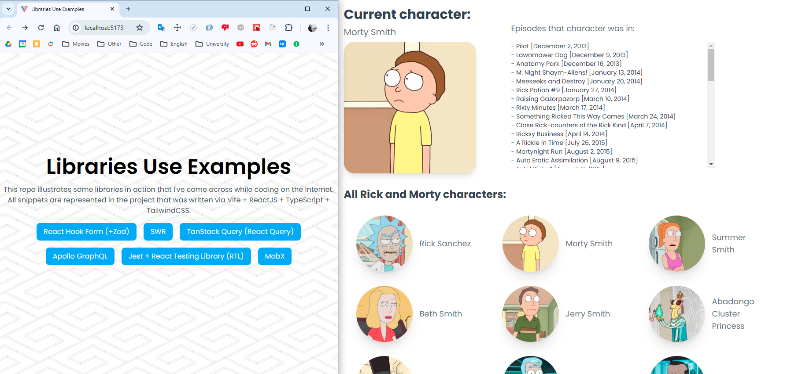

<!-- --------STATS-------- -->
 

<!-- --------LOGO-------- -->
 

	 
	
	
<strong>libraries-demo-use</strong> - this repo illustrates some libraries in action that I've come across while coding on the Internet. All snippets are represented in the project.

<!-- --------TABLE OF CONTENTS-------- -->

  
Table of Contents

  <ol>
    <li>
      <a href="#about-the-project">About The Project</a>
    </li>
    <li><a href="#contributing">Contributing</a></li>
    <li><a href="#contact">Contact</a></li>
  </ol>

<!-- --------ABOUT THE PROJECT-------- -->

## About The Project

	

<strong>libraries-demo-use</strong> - built via:

<ul>
	<li>React Hook Form (+Zod)</li>
	<li>SWR</li>
	<li>TanStack Query (React Query)</li>
	<li>GraphQL + Apollo React Client</li>
	<li>Jest + React Testing Library (RTL)</li>
	<li>MobX</li>
	<li>TypeScript</li>
	<li>Vite</li>
	<li>React JS</li>
	<li>React Router</li>
	<li>Axios</li>
</ul>

<!-- --------CONTRIBUTING-------- -->

## Contributing

Contributions are what make the open source community such an amazing place to learn, inspire, and create. Any contributions you make are **greatly appreciated**.

If you have a suggestion that would make this better, please fork the repo and create a pull request. You can also simply open an issue with the tag "enhancement".
Don't forget to give the project a star! Thanks again!

1. Fork the Project
2. Create your Feature Branch (`git checkout -b feature/AmazingFeature`)
3. Commit your Changes (`git commit -m 'Add some AmazingFeature'`)
4. Push to the Branch (`git push origin feature/AmazingFeature`)
5. Open a Pull Request

<!-- --------LICENSE-------- -->

## License

Distributed under the GNU GPL v3.0 License. See `LICENSE` for more information.

<!-- --------CONTACT-------- -->

## Contact

Danil Ochagov - danilochagov@gmail.com
